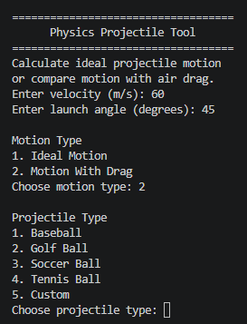
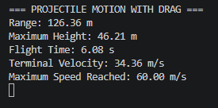
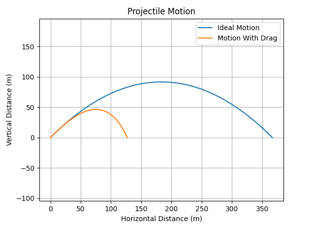

## Projectile Motion Calculator

This project is a Python-based projectile motion simulator that calculates and visualizes the trajectory of an object launched at a 
specified velocity and angle. The simulator applies classical kinematic equations to determine flight time, maximum height, and 
horizontal range.

## Project Motivation

This project was created to combine programming and engineering principles by modeling real-world projectile motion. The simulator allows users to compare idealized physics equations with more realistic drag-based motion and visualize the differences through trajectory graphs. 

## Features

- Simulates ideal projectile motion without air resistance
- Simulates projectile motion with aerodynamic drag
- Supports both custom inputs and predefined projectile types
- Calculates:
  - Horizontal range
  - Maximum height
  - Total flight time
  - Terminal velocity
  - Maximum speed reached
- Generates trajectory graphs for visual analysis
- Compares ideal and drag-affected trajectories
- Object-oriented design with separated physics and user interface modules
- Input validation and error handling

## Example Output

### Main Interface



### Simulation Results



### Trajectory Comparison



## Physics Model

The simulator uses standard projectile motion equations:

Range:
R = (v₀² sin(2θ)) / g

Maximum Height:
H = (v₀² sin²(θ)) / (2g)

Flight Time:
T = (2v₀ sin(θ)) / g

## Technologies Used

- Python
- Math (Standard Library)
- Matplotlib

## How to Run

Clone the repository:

```bash
git clone https://github.com/matt8casey/projectile-motion-simulator.git
```

Install dependencies:

```bash
pip install -r requirements.txt
```

Run the simulator:

```bash
python main.py
```

## Future Improvements

- Calculate impact speed at landing
- Calculate minimum speed during flight
- Add wind effects
- Add real-time trajectory animation
- Export simulation data to CSV
- Develop a graphical user interface (GUI)
- Support additional projectile presets

## Author

Matthew Casey
Mechanical/Robotics Engineering Student